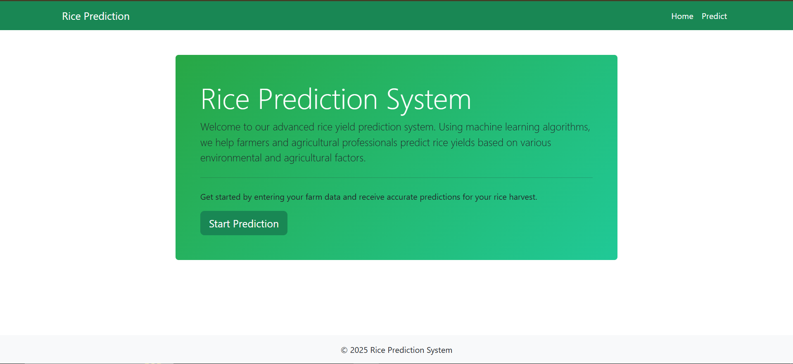
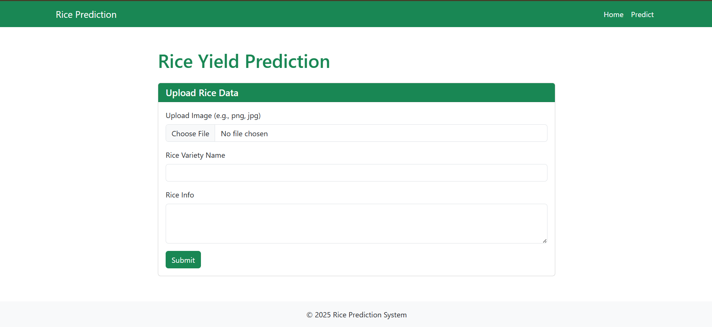
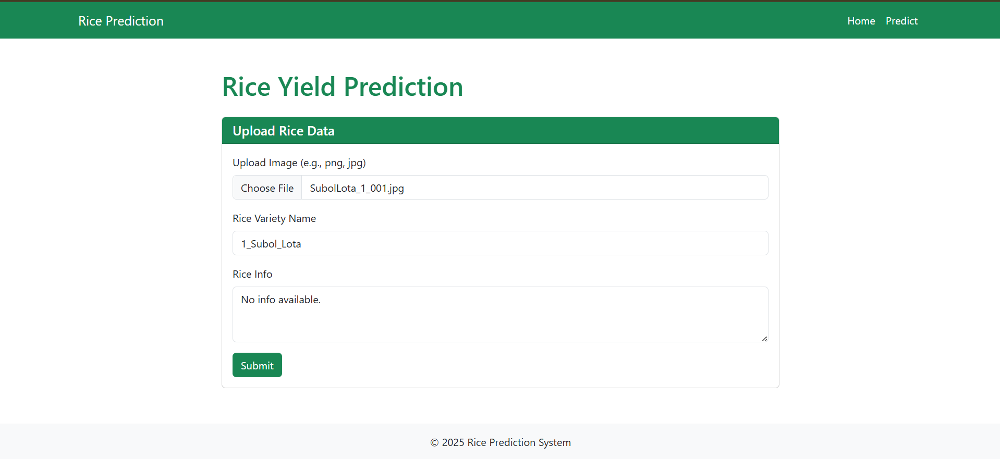

# Rice Classification System

## Project Summary

The Rice Classification System is a web-based application that leverages deep learning technology to accurately classify 62 different varieties of rice grains. Built with Django as the backend framework, it provides an intuitive user interface for uploading rice grain images and receiving instant classification results. The system uses a pre-trained VGG16 convolutional neural network model to analyze images and predict rice types with high confidence scores. This tool is designed for agricultural professionals, researchers, and enthusiasts to quickly identify rice varieties, supporting applications in quality control, research, and education.

## Screenshots

### Home Page


### Before Prediction


### After Prediction


## Components Used

The Rice Classification System is composed of several key components with their usage details:

- **Backend Framework**: Django 5.x - Handles server-side logic, routing, and API endpoints
- **Machine Learning Model**: VGG16 (TensorFlow/Keras) - Pre-trained convolutional neural network for image classification
- **Image Processing**: PIL/Pillow - Library for image manipulation and preprocessing
- **Database**: SQLite - Used as the default database for storing application data including user inputs, prediction results, and system configurations. It can be replaced with other databases if needed.
- **Frontend Technologies**:
  - HTML5 - Markup for structuring web pages
  - CSS3 - Styling for responsive and user-friendly design
  - JavaScript - Adds client-side interactivity and dynamic content
- **Web Server**: Django's built-in development server for development; WSGI-compatible servers recommended for production deployment
- **Model Storage**: HDF5 format (.h5) - Stores the trained model weights for loading during prediction

## 🚀 Features

### Web Application
- **Image Upload**: Users can upload rice grain images for classification
- **Real-time Prediction**: Instant classification results using VGG16 model
- **Confidence Scores**: Displays prediction confidence for each rice type
- **62 Rice Types**: Supports classification of 62 different rice varieties
- **Responsive Design**: Works on desktop and mobile devices
- **REST API**: Provides API endpoints for potential integrations

## Installation

### Web Application

1. Clone the repository:
```bash
git clone <repository-url>
cd Rice_Prediction
```

2. Install dependencies:
```bash
pip install -r requirements.txt
```

3. Run migrations:
```bash
python manage.py migrate
```

4. Start the development server:
```bash
python manage.py runserver
```

## Usage

### Web

1. Open your browser and navigate to `http://localhost:8000`
2. Click on "Predict Rice Type"
3. Upload a rice grain image
4. View the classification results with confidence scores

## Model Information

- **Architecture**: VGG16
- **Training Dataset**: 62 rice varieties
- **Accuracy**: High accuracy on test dataset
- **Model File**: `models/best_VGG16_stage2.weights.h5`

## Supported Rice Types

The application can classify the following rice varieties:
- 1_Subol_Lota
- 2_Bashmoti
- 3_Ganjiya
- 4_Shampakatari
- 5_Katarivog
- 6_BR28
- 7_BR29
- 8_Paijam
- 9_Bashful
- 10_Lal_Aush
- 11_Jirashail
- 12_Gutisharna
- 13_Red_Cargo
- 14_Najirshail
- 15_Katari_Polao
- 16_Lal_Biroi
- 17_Chinigura_Polao
- 18_Amondhan
- 19_Shorna5
- 20_Lal_Binni
- 21_Arborio
- 22_Turkish_Basmati
- 23_Ipsala
- 24_Jasmine
- 25_Karacadag
- 26_BD30
- 27_BD33
- 28_BD39
- 29_BD49
- 30_BD51
- 31_BD52
- 32_BD56
- 33_BD57
- 34_BD70
- 35_BD72
- 36_BD75
- 37_BD76
- 38_BD79
- 39_BD85
- 40_BD87
- 41_BD91
- 42_BD93
- 43_BD95
- 44_Binadhan7
- 45_Binadhan8
- 46_Binadhan10
- 47_Binadhan11
- 48_Binadhan12
- 49_Binadhan14
- 50_Binadhan16
- 51_Binadhan17
- 52_Binadhan19
- 53_Binadhan21
- 54_Binadhan24
- 55_Binadhan25
- 56_Binadhan26
- 57_BR22
- 58_BR23
- 59_BRRI67
- 60_BRRI74
- 61_BRRI102
- 62_Binadhan23

## Technical Stack

- **Backend**: Django 5.x, Django REST Framework
- **Frontend**: HTML5, CSS3, JavaScript
- **ML Framework**: TensorFlow/Keras
- **Image Processing**: PIL/Pillow
- **Database**: SQLite (default)

## Project Structure

```
Rice_Prediction/
├── rice_prediction/          # Django project settings
├── prediction/               # Main app for rice classification
│   ├── views.py             # Prediction logic (web)
│   ├── api_views.py         # API views for integrations
│   ├── serializers.py       # DRF serializers
│   ├── models.py            # Database models
│   └── urls.py              # URL configurations
├── templates/               # HTML templates
├── static/                  # CSS, JS, images
├── asset/                   # Screenshots and assets
├── requirements.txt         # Python dependencies
├── manage.py                # Django management script
└── README.md
```

## Development

### Running Tests
```bash
python manage.py test prediction
```

### Adding New Rice Types
To add support for new rice types, you'll need to:
1. Retrain the model with new data
2. Update the class mapping in `views.py` and `api_views.py`
3. Update the frontend to display new types

## Contributing

1. Fork the repository
2. Create a feature branch (`git checkout -b feature/new-feature`)
3. Commit your changes (`git commit -am 'Add new feature'`)
4. Push to the branch (`git push origin feature/new-feature`)
5. Create a Pull Request

## License

This project is open source and available under the [MIT License](LICENSE).
